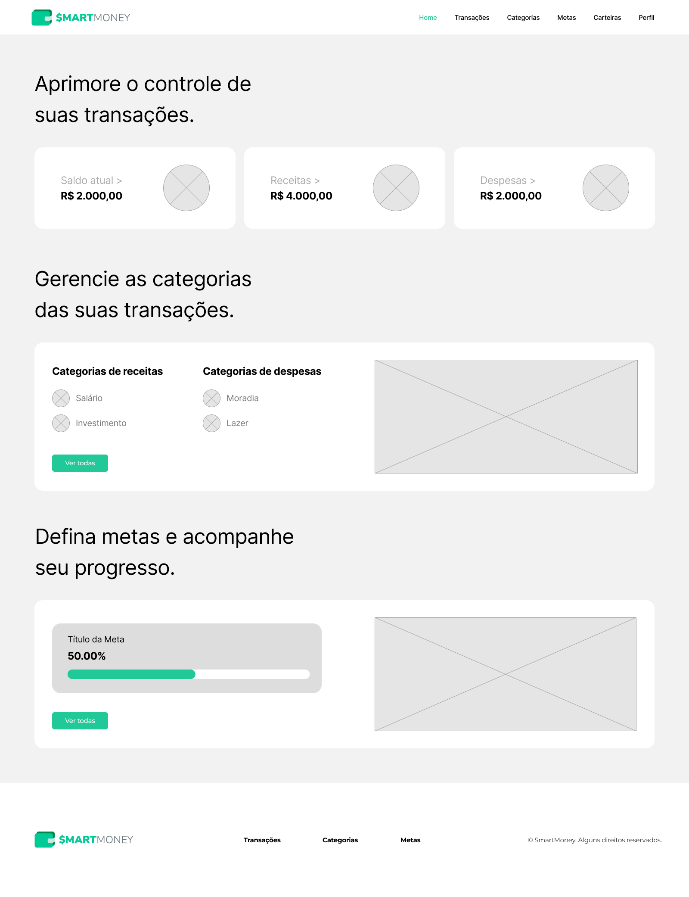

# Projeto de Interface

Estamos dando foco a diversas questões durante a criação da interface do sistema, incluindo agilidade, acessibilidade e usabilidade. Esses aspectos estão sendo cuidadosamente considerados para garantir que o projeto tenha uma identidade visual consistente em todas as telas, tanto para desktops quanto para dispositivos móveis.

## Diagrama de Fluxo

O Diagrama de Fluxo apresenta um modelo que ilustra como o usuário pode navegar pelo sistema por meio das telas, seguindo o planejamento da aplicação, em conformidade com os requisitos funcionais, não funcionais, restrições e histórias das personas.

|  |
| :---------------------------------------------------------------------------------------: |
|                      *Figura 1 - Primeira parte do fluxo do usuário*                      |

|  |
| :-------------------------------------------------------------------------------------: |
|                      *Figura 2 - Última parte do fluxo do usuário*                      |

## Wireframes
Para visualizar as telas pelo figma, <a href="https://www.figma.com/proto/i82jdwAs6KlARlZxxf8Nj8/SmartMoney?type=design&node-id=1-521&t=Xo38WHN7p66vuQZA-0&scaling=scale-down-width&page-id=0%3A1">clique aqui</a>. Ao acessar o link, basta passar para o lado para visualizar todas as telas.

<table style="border-collapse: collapse;">
   <tr>
    <td style="border: 1px solid black; padding: 10px;">
      
      
1 - Página de cadastro.

    </td>
    <td style="border: 1px solid black; padding: 10px;">
      
      
2 - Página de login.

    </td>
    <td style="border: 1px solid black; padding: 10px;">
      
      
3 - Página de recuperação de senha.

    </td>
  </tr>
</table>

|  |       
| :-------------------------------------------------------------: |  
|                      4 - Página de dashboard (home)           |

<table style="border-collapse: collapse;">
  <tr>
    <td style="border: 1px solid black; padding: 10px;">
      
      
5 - Página de transações. Nessa tela o usuário poderá visualizar, filtrar, criar, editar e excluir transações.

    </td>
    <td style="border: 1px solid black; padding: 10px;">
      
     
6 - Modal aberta quando o usuário clica no botão "+ nova transação".

    </td>
  </tr>
</table>

<table style="border-collapse: collapse;">
  <tr>
    <td style="border: 1px solid black; padding: 10px;">
      
      
7 - Página de categorias. Nessa tela o usuário poderá visualizar, criar, editar e excluir categorias.

    </td>
    <td style="border: 1px solid black; padding: 10px;">
      
     
8 - Modal aberta quando o usuário clica no botão "+ nova categoria".

    </td>
  </tr>
</table>

<table style="border-collapse: collapse;">
  <tr>
    <td style="border: 1px solid black; padding: 10px;">
      
      
9 - Página de metas. Nessa tela o usuário poderá visualizar, criar, editar e excluir metas.

    </td>
    <td style="border: 1px solid black; padding: 10px;">
      
     
10 - Esta modal é aberta quando o usuário clica no botão "+ nova meta".

    </td>
  </tr>
</table>

<table style="border-collapse: collapse;">
  <tr>
    <td style="border: 1px solid black; padding: 10px;">
      
      
11 - Página de carteiras. Nessa tela o usuário poderá visualizar, criar e excluir carteiras.

    </td>
    <td style="border: 1px solid black; padding: 10px;">
      
     
12 - Modal aberta quando o usuário clica no botão "+ nova carteira".

    </td>
  </tr>
</table>

|  |       
| :-------------------------------------------------------------: |  
|                      13 - Página de perfil. Nessa tela o usuário poderá editar seu perfil, atualizar sua senha e excluir sua conta.           |
