# Programação de Funcionalidades

<!-- Pré-requisitos: <a href="2-Especificação do Projeto.md"> Especificação do Projeto</a>, <a href="3-Projeto de Interface.md"> Projeto de Interface</a>, <a href="4-Metodologia.md"> Metodologia</a>, <a href="3-Projeto de Interface.md"> Projeto de Interface</a>, <a href="5-Arquitetura da Solução.md"> Arquitetura da Solução</a> -->

<!-- Implementação do sistema descrita por meio dos requisitos funcionais e/ou não funcionais. Deve relacionar os requisitos atendidos com os artefatos criados (código fonte), deverão apresentadas as instruções para acesso e verificação da implementação que deve estar funcional no ambiente de hospedagem.

Por exemplo: a tabela a seguir deverá ser preenchida considerando os artefatos desenvolvidos. -->

Nesta seção são apresentadas as telas desenvolvidas para cada uma das funcionalidades 
do sistema. <!--  O respectivo endereço (URL) e outras orientações de acesso são são -->
<!-- apresentadas na sequência. -->

## Página de Cadastro do Usuário (RF-001)

A página de cadastro do usuário apresenta a funcionalidade do usuário criar uma conta na aplicação.

|ID    | Descrição do Requisito  | Artefato(s) produzido(s) |
|------|-----------------------------------------|----|
|RF-001| Permitir que o usuário gerencie sua conta. | Models/Usuario.cs  Controllers/UsuariosController.cs  Views/Usuarios/Create.cshtml | 

| 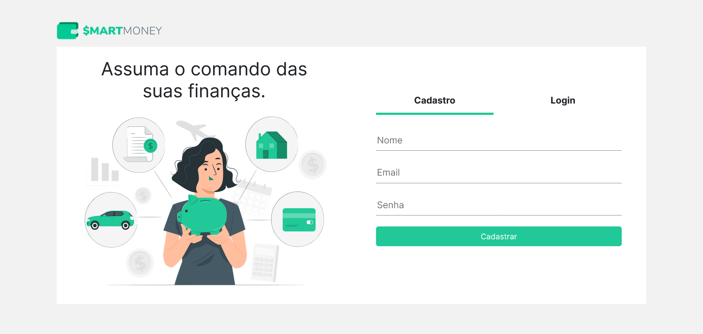 |
| :---------------------------------------------------------------------------------------: |
|                                     *Página de cadastro do usuário*                      |

## Página de Login (RF-001)

A página de Login apresenta a funcionalidade do usuário acessar sua conta.

|ID    | Descrição do Requisito  | Artefato(s) produzido(s) |
|------|-----------------------------------------|----|
|RF-001| Permitir que o usuário gerencie sua conta. | Models/Usuario.cs  Controllers/UsuariosController.cs  Views/Usuarios/Login.cshtml | 

| 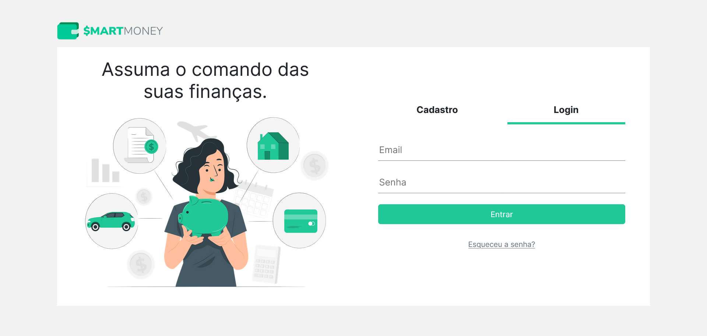 |
| :---------------------------------------------------------------------------------------: |
|                                     *Página de Login*                      |

## Página de Recuperação de Senha (RF-001)

A página de recuperação de senha apresenta a funcionalidade do usuário recuperar a senha da sua conta.

|ID    | Descrição do Requisito  | Artefato(s) produzido(s) |
|------|-----------------------------------------|----|
|RF-001| Permitir que o usuário gerencie sua conta. | Models/Usuario.cs  Models/ViewModels/UsuarioEdit.cs  Controllers/UsuariosController.cs  Views/Usuarios/EsqueciSenha.cshtml  Services/BrevoService.cs  Services/IEmailService.cs  Settings/BrevoSettings.cs  appsettings.json  Program.cs| 

|  |
| :---------------------------------------------------------------------------------------: |
|                                     *Página de Recuperação de Senha*                      |

## Páginas de Perfil do Usuário: Editar dados, Editar senha, Deletar conta e Logout (RF-001)

* A página perfil do usuário apresenta a funcionalidade do usuário editar nome, e-mail e realizar logout;
* A página perfil do usuário atualizar senha apresenta a funcionalidade do usuário atualizar sua senha;
* A página perfil do usuário apagar conta apresenta a funcionalidade do usuário deletar sua conta;

|ID    | Descrição do Requisito  | Artefato(s) produzido(s) |
|------|-----------------------------------------|----|
|RF-001| Permitir que o usuário gerencie sua conta. | Models/Usuario.cs  Controllers/UsuariosController.cs  Views/Usuarios/Edit.cshtml  Views/Usuarios/EditPassword.cshtml  Views/Usuarios/Delete.cshtml| 

<table style="border-collapse: collapse;">
   <tr>
    <td style="border: 1px solid black; padding: 10px;">
      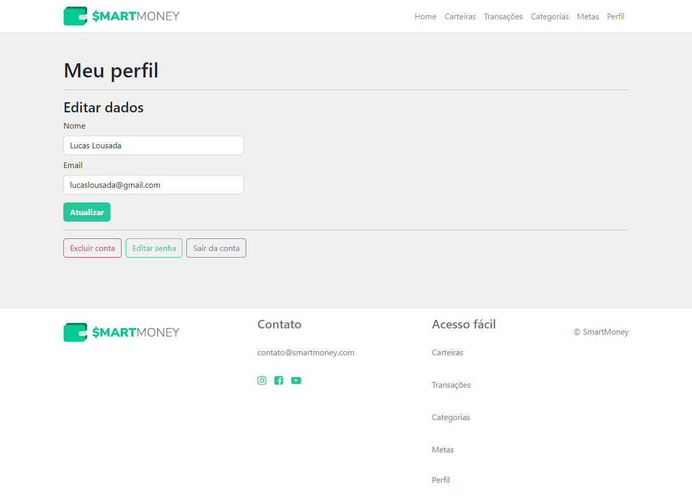
    </td>
    <td style="border: 1px solid black; padding: 10px;">
      
    </td>
    <td style="border: 1px solid black; padding: 10px;">
      
    </td>
  </tr>
</table>

## Páginas de Carteira: Index, Criar, Visualizar, Editar, Deletar (RF-002)

* A página inicial (index) apresenta a lista de carteiras que o usuário possui;
* A página criar permite que o usuário crie uma carteira;
* A pagina visualizar permite que o usuário visualize detalhes de uma carteira;
* A página editar permite que o usuário edite uma carteira;
* A página deletar permite que o usuário delete uma carrteira.

|ID    | Descrição do Requisito  | Artefato(s) produzido(s) |
|------|-----------------------------------------|----|
|RF-002| Permitir que o usuário gerencie sua carteira. |Models/Carteira.cs  Controllers/CarteirasController.cs  Views/Carteiras/Index.cshtml  Views/Carteiras/Create.cshtml  Views/Carteiras/Edit.cshtml  Views/Carteiras/Details.cshtml  Views/Carteiras/Delete.cshtml|

<table style="border-collapse: collapse;">
   <tr>
    <td style="border: 1px solid black; padding: 10px;">
      
    </td>
    <td style="border: 1px solid black; padding: 10px;">
      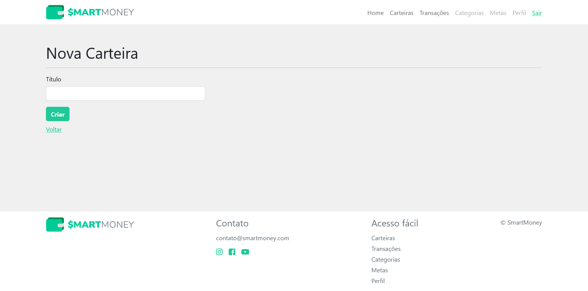
    </td>
    <td style="border: 1px solid black; padding: 10px;">
      
    </td>
    <td style="border: 1px solid black; padding: 10px;">
      
    </td>
    <td style="border: 1px solid black; padding: 10px;">
      
    </td>
  </tr>
</table>

## Páginas de Transação: Index, Criar, Visualizar, Editar, Deletar (RF-003)

* A página inicial (index) apresenta a lista de transações que o usuário possui;
* A página criar permite que o usuário crie uma transação;
* A pagina visualizar permite que o usuário visualize detalhes de uma transação;
* A página editar permite que o usuário edite uma transação;
* A página deletar permite que o usuário delete uma transação.

|ID    | Descrição do Requisito  | Artefato(s) produzido(s) |
|------|-----------------------------------------|----|
|RF-003| Permitir que o usuário gerencie transações de entrada e saída. |Models/Transacao.cs  Controllers/TransacoesController.cs  Views/Transacoes/Index.cshtml  Views/Transacoes/Create.cshtml  Views/Transacoes/Details.cshtml  Views/Transacoes/Edit.cshtml  Views/Transacoes/Delete.cshtml  | 

<table style="border-collapse: collapse;">
   <tr>
    <td style="border: 1px solid black; padding: 10px;">
      
    </td>
    <td style="border: 1px solid black; padding: 10px;">
      
    </td>
    <td style="border: 1px solid black; padding: 10px;">
      
    </td>
    <td style="border: 1px solid black; padding: 10px;">
      
    </td>
    <td style="border: 1px solid black; padding: 10px;">
      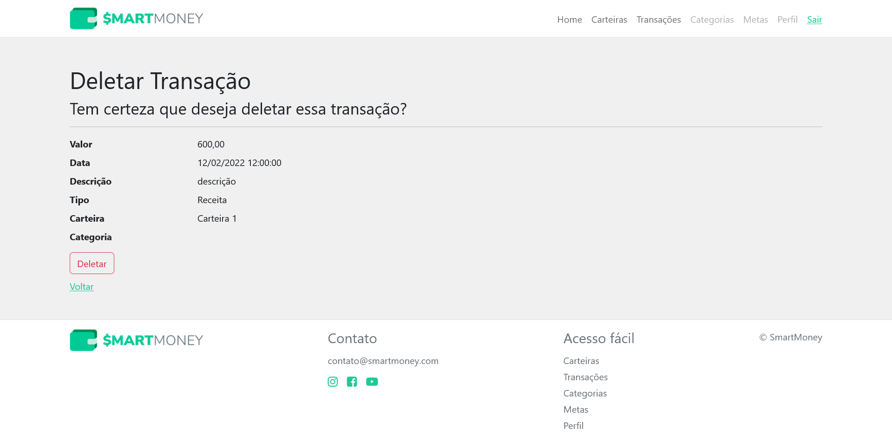
    </td>
  </tr>
</table>

## Páginas de Categoria: Index, Criar, Visualizar, Editar, Deletar (RF-004)

* A página inicial (index) apresenta a lista de categorias que o usuário possui;
* A página criar permite que o usuário crie uma categoria;
* A pagina visualizar permite que o usuário visualize detalhes de uma categoria;
* A página editar permite que o usuário edite uma categoria;
* A página deletar permite que o usuário delete uma categoria.

|ID    | Descrição do Requisito  | Artefato(s) produzido(s) |
|------|-----------------------------------------|----|
|RF-004| Permitir que o usuário gerencie categorias para transações. |Models/Categoria.cs  Controllers/CategoriasController.cs  Views/Categorias/Index.cshtml  Views/Categorias/Create.cshtml  Views/Categorias/Details.cshtml  Views/Categorias/Edit.cshtml  Views/Categorias/Delete.cshtml  | 

<table style="border-collapse: collapse;">
   <tr>
    <td style="border: 1px solid black; padding: 10px;">
      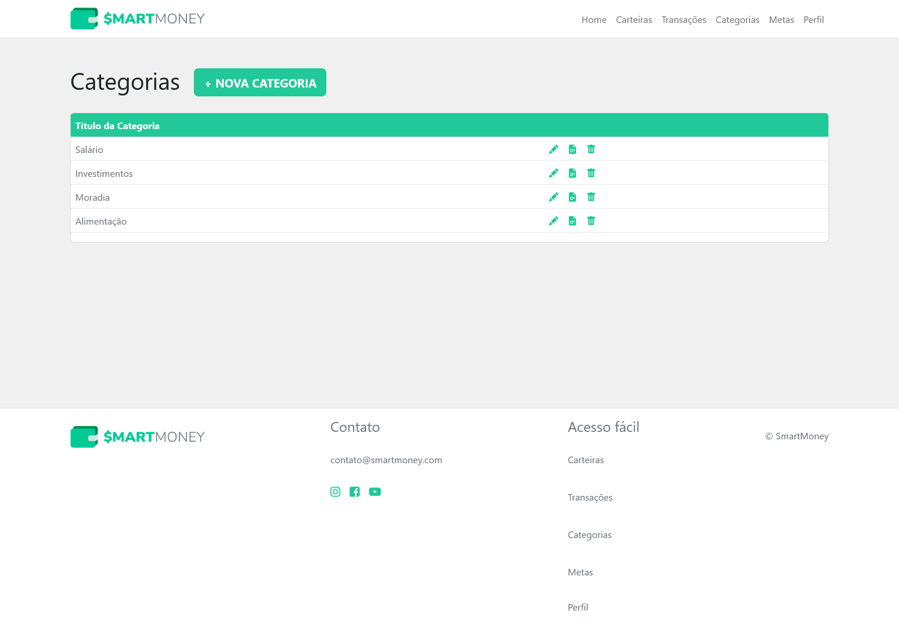
    </td>
    <td style="border: 1px solid black; padding: 10px;">
      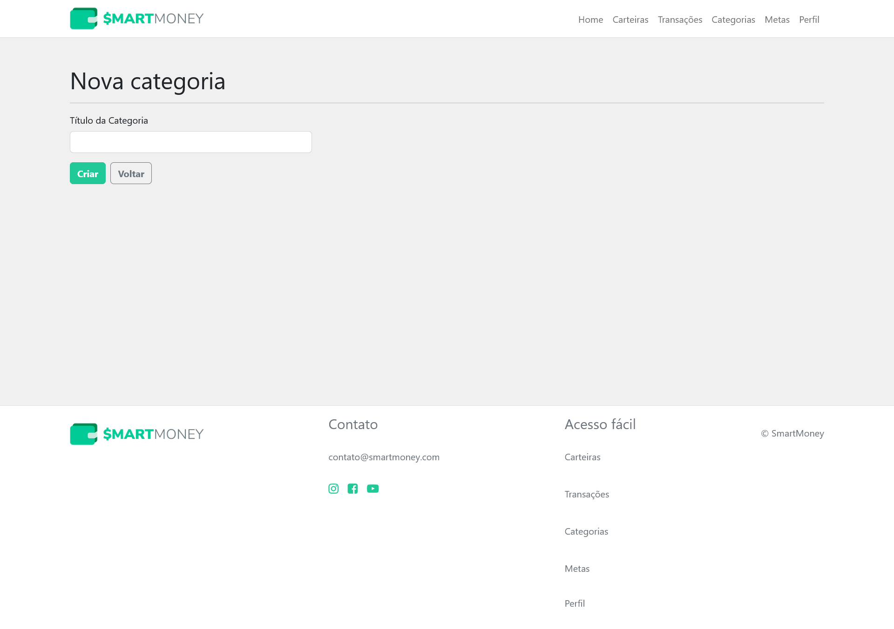
    </td>
    <td style="border: 1px solid black; padding: 10px;">
      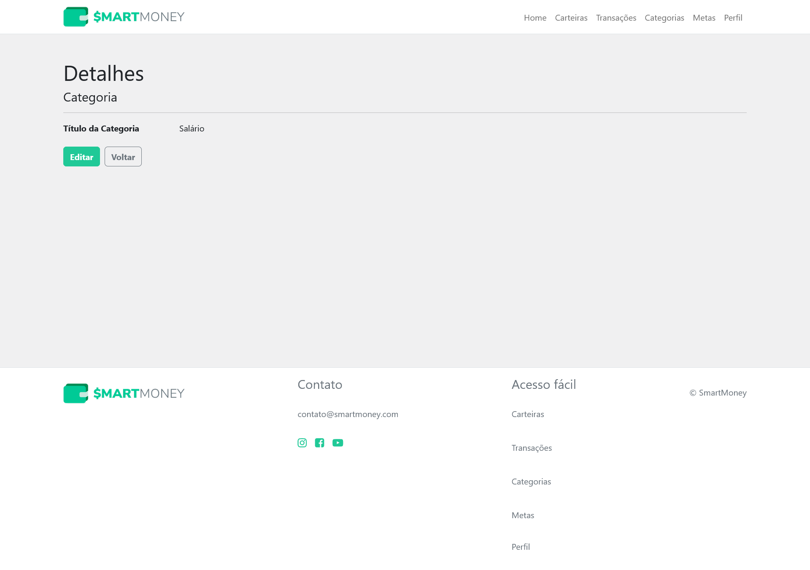
    </td>
    <td style="border: 1px solid black; padding: 10px;">
      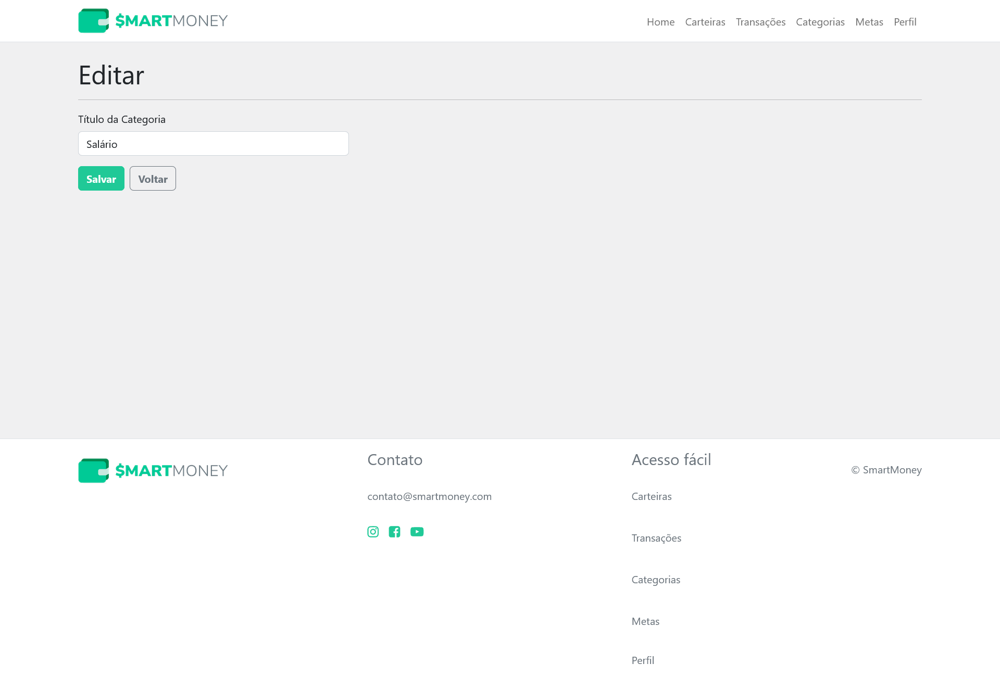
    </td>
    <td style="border: 1px solid black; padding: 10px;">
      
    </td>
  </tr>
</table>

## Páginas de Meta: Index, Criar, Visualizar, Editar, Deletar (RF-005)

* A página inicial (index) apresenta a lista de metas que o usuário possui;
* A página criar permite que o usuário crie uma meta;
* A pagina visualizar permite que o usuário visualize detalhes de uma meta;
* A página editar permite que o usuário edite uma meta;
* A página deletar permite que o usuário delete uma meta.

|ID    | Descrição do Requisito  | Artefato(s) produzido(s) |
|------|-----------------------------------------|----|
|RF-005| Permitir que o usuário gerencie metas financeiras pessoais. |Models/Meta.cs  Controllers/MetasController.cs  Views/Metas/Index.cshtml  Views/Metas/Create.cshtml  Views/Metas/Details.cshtml  Views/Metas/Edit.cshtml  Views/Metas/Delete.cshtml  | 

<table style="border-collapse: collapse;">
   <tr>
    <td style="border: 1px solid black; padding: 10px;">
      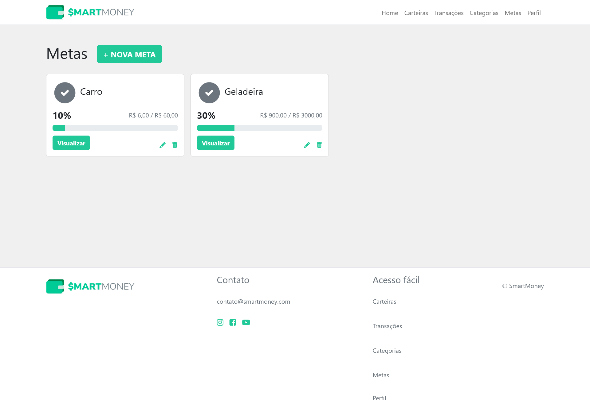
    </td>
    <td style="border: 1px solid black; padding: 10px;">
      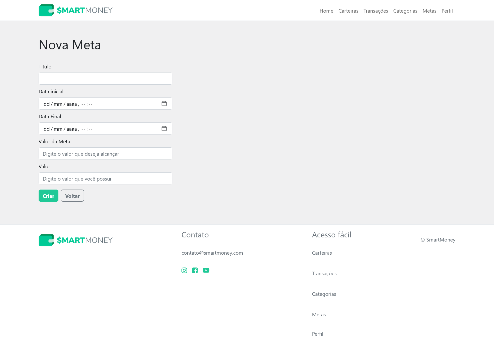
    </td>
    <td style="border: 1px solid black; padding: 10px;">
      
    </td>
    <td style="border: 1px solid black; padding: 10px;">
      
    </td>
    <td style="border: 1px solid black; padding: 10px;">
      
    </td>
  </tr>
</table>

## Página Home (Dashboard) (RF-006)

|ID    | Descrição do Requisito  | Artefato(s) produzido(s) |
|------|-----------------------------------------|----|
|RF-006| Permitir que o usuário visualize o cálculo das entradas, saídas e o total.| Controllers/HomeController.cs  Views/Home/Index.cshtml | 

| 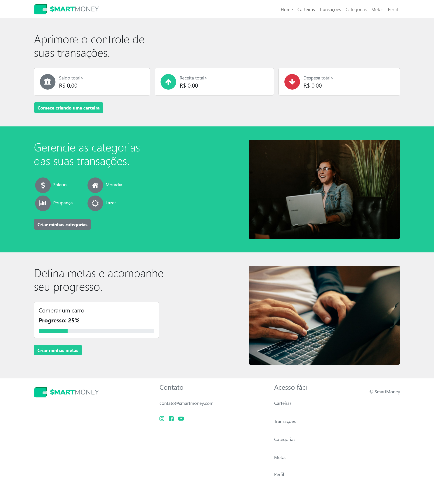 |
| :---------------------------------------------------------------------------------------: |

## Filtro de transações (RF-007)

|ID    | Descrição do Requisito  | Artefato(s) produzido(s) |
|------|-----------------------------------------|----|
|RF-007| Permitir que o usuário filtre suas transações por data, tipo e categoria.| Controllers/TransacoesController.cs  Views/Transacoes/Index.cshtml | 

|  |
| :---------------------------------------------------------------------------------------: |

# Instruções de acesso

A aplicação, que contém todas as funcionalidades descritas acima, pode ser acessada por meio [deste link](https://smartmoney-app.azurewebsites.net).

<!-- Não deixe de informar o link onde a aplicação estiver disponível para acesso (por exemplo: https://adota-pet.herokuapp.com/src/index.html).

Se houver usuário de teste, o login e a senha também deverão ser informados aqui (por exemplo: usuário - admin / senha - admin).

O link e o usuário/senha descritos acima são apenas exemplos de como tais informações deverão ser apresentadas.

> **Links Úteis**:
>
> - [Trabalhando com HTML5 Local Storage e JSON](https://www.devmedia.com.br/trabalhando-com-html5-local-storage-e-json/29045)
> - [JSON Tutorial](https://www.w3resource.com/JSON)
> - [JSON Data Set Sample](https://opensource.adobe.com/Spry/samples/data_region/JSONDataSetSample.html)
> - [JSON - Introduction (W3Schools)](https://www.w3schools.com/js/js_json_intro.asp)
> - [JSON Tutorial (TutorialsPoint)](https://www.tutorialspoint.com/json/index.htm) -->
